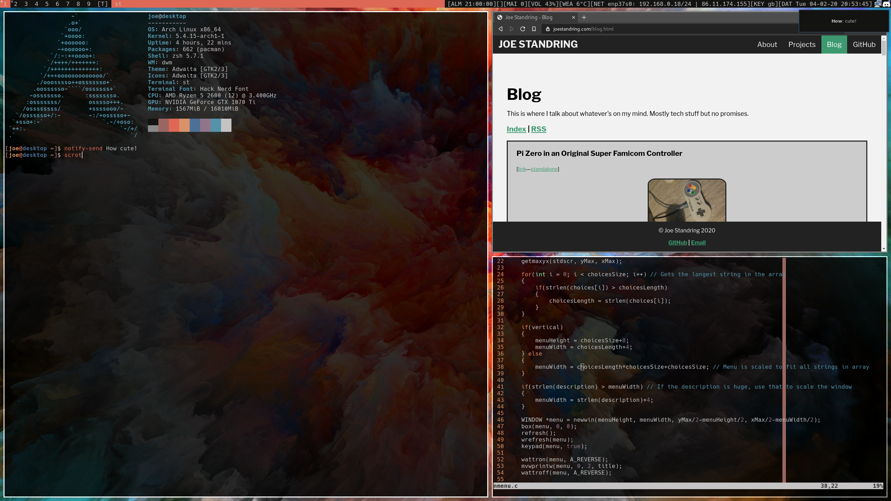

# A Beautiful Waste of Time
These are the dotfiles I use for my Arch Linux install

## What I Use
* Window manager: [dwm](https://dwm.suckless.org/) ([systray](https://dwm.suckless.org/patches/systray/) [tilegap](https://dwm.suckless.org/patches/tilegap/))
* Statusbar: [dwm-bar](https://github.com/joestandring/dwm-bar)
* Terminal: [st](https://st.suckless.org/) ([alpha](https://st.suckless.org/patches/alpha/) [scrollback](https://st.suckless.org/patches/scrollback/))
* Application launcher: [dmenu](https://dmenu.suckless.org/)
* Launcher: [dmenu](https://tools.suckless.org/dmenu/)
* Font: [Hack Nerd Font](https://github.com/ryanoasis/nerd-fonts)
* Compositor: [picom](https://github.com/yshui/picom)
* Editor: [NeoVim](https://neovim.io) with:
    * [vim-plug](https://github.com/junegunn/vim-plug)
    * [deoplete](https://github.com/Shougo/deoplete.nvim)
    * [ale](https://github.com/dense-analysis/ale)
    * [vim-surround](https://github.com/tpope/vim-surround)
    * [vim-shellcheck](https://github.com/itspriddle/vim-shellcheck)
* Theming: [Pywal](https://github.com/dylanaraps/pywal)
* Shell: [Zsh](https://sourceforge.net/projects/zsh/) with:
    * [zsh-syntax-highlighting](https://github.com/zsh-users/zsh-syntax-highlighting)
* Notifications: [Dunst](https://github.com/dunst-project/dunst) using a [Pywal script](https://github.com/GloverDonovan/dotfiles/blob/eff7623a9a2e9c7ccedb2c95a1730ac4d523ed9c/wal/.config/wal/templates/dunstrc)
* Video player: [mpv](https://github.com/mpv-player/mpv)
* RSS reader: [Newsboat](https://github.com/newsboat/newsboat)
* System information: [Neofetch](https://github.com/dylanaraps/neofetch)
